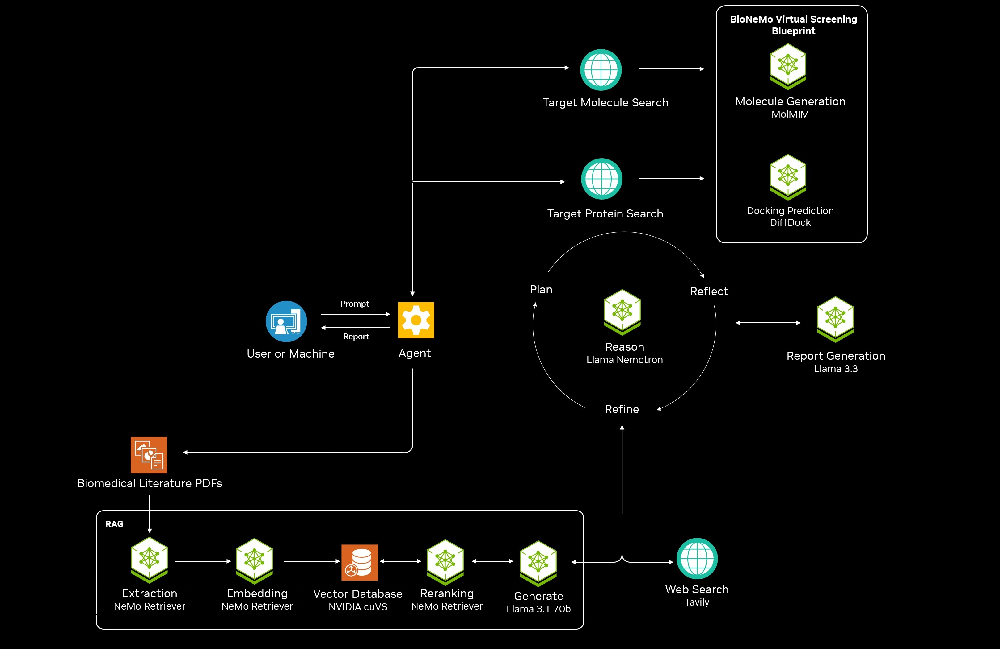

# NVIDIA Biomedical AI-Q Research Agent Developer Blueprint

## Overview

The NVIDIA [Biomedical AI-Q Research Agent Developer Blueprint](https://build.nvidia.com/nvidia/biomedical-aiq-research-agent) allows you to create a deep research agent with virtual screening capabilities that can run on-premise, allowing anyone to create detailed research reports using on-premise data and web search. This developer blueprint is built on top of the [AI-Q NVIDIA Research Assistant Blueprint](https://build.nvidia.com/nvidia/aiq). We have added capabilities from the [Virtual Screening Blueprint](https://build.nvidia.com/nvidia/generative-virtual-screening-for-drug-discovery) in addition to the research capability, so that when a biomedical research is investigating a condition or disease, with a target protein and recent small-molecule therapy, virtual screening can help with discovering novel small-molecule therapies through molecular generation and docking. This developer blueprint serves as a demonstration on how you could add in your own additional custom functionalities that may not be virtual screening, to the existing research and report generation functionalities in the foundational [AI-Q NVIDIA Research Assistant Blueprint](https://build.nvidia.com/nvidia/aiq).

## Table of Contents

- [Key Features](#key-features)
- [Target Audience](#target-audience)
- [Software Components](#software-components)
- [Technical Diagram](#technical-diagram)
- [Minimum System Requirements](#minimum-system-requirements)
  - [OS Requirements](#os-requirements)
  - [Deploy Options](#deploy-options)
  - [Drivers](#drivers)
  - [Hardware Requirements](#hardware-requirements)
  - [API Keys](#api-keys)
- [Next Steps](#next-steps)
- [License](#license)
- [Security Considerations](#security-considerations)

## Key Features

- **Deep Research**: Given a report topic and desired report structure, an agent (1) creates a report plan, (2) searches data sources for answers, (3) writes a report, (4) reflects on gaps in the report for further queries, (5) finishes a report with a list of sources.
- **Parallel Search**: During the research phase, multiple research questions are searched in parallel. For each query, the RAG service is consulted and an LLM-as-a-judge is used to check the relevancy of the results. If more information is needed, a fallback web search is performed. This search approach ensures internal documents are given preference over generic web results while maintaining accuracy. Performing query search in parallel allows for many data sources to be consulted in an efficient manner.
- **Human-in-the-loop**: Human feedback on the report plan, interactive report edits, and Q&A with the final report.
- **Data Sources**: Integration with the NVIDIA RAG blueprint to search multimodal documents with text, charts, and tables. Optional web search through Tavily.
- **Demo Web Application**: Frontend web application showcasing end-to-end use of the Biomedical AI-Q Research Agent.
- **Virtual Screening**: Virtual Screening capabilities for discovering novel small-molecule therapies when researching a disease or condition. Including MolMIM for novel molecular generation and DiffDock for predicting the 3D structure of how a molecule interacts with a protein.
- **Demonstration of Customizing the AI-Q Research Assistant Blueprint**: This blueprint demonstrates how we could add the Virtual Screeing capabilities into the foundational AI-Q Research Assistant Blueprint, and similarly, how other customized capabilities can be added into the foundational research AI-Q Research Assistant Blueprint.

## Target Audience

- *Biomedical Researchers:* This developer blueprint can be deployed by IT organizations to provide an on-premise deep research application with virtual screening capabilities for biomedical researchers
- *Developers:* This developer blueprint serves as a reference architecture for teams to add their own custom capabilities to a research-only agent

## Software Components 

The Biomedical AI-Q Research Agent Developer Blueprint provides these components:

- **Demo Frontend**: A docker container with a fully functional demo web application is provided. This web application is deployed by default if you follow the getting started guides and is the easiest way to quickly experiment with deep research using internal data sources via the NVIDA RAG blueprint. The source code for this demo web application is not distributed. 
- **Backend Service via RESTful API**: The main Biomedical AI-Q Research Agent code is distributed as the `aiq-aira` Python package located in the `/aira` directory. These backend functions are available directly or via a RESTful API.
- **Middleware Proxy**: An nginx proxy is deployed as part of the getting started guides. This proxy enables frontend web applications to interact with a single backend service. In turn, the proxy routes requests between the NVIDIA RAG blueprint services and the Biomedical AI-Q Research Agent service.

Additionally, the blueprint uses these components:

- [**AI-Q NVIDIA Research Assistant Blueprint**](https://build.nvidia.com/nvidia/aiq) Provides research and report generation capabilities. This the baseline foundational blueprint that this developer blueprint adapts from and modifies.
- [**Virtual Screening Blueprint**](https://build.nvidia.com/nvidia/generative-virtual-screening-for-drug-discovery) Provides virtual screening capabilities for discovering novel small-molecule therapies. We are specifically using the following components of the Virtual Screening Blueprint:
  - [MolMIM](https://build.nvidia.com/nvidia/molmim-generate) for controlled generation of new molecules, finding molecules with the right properties based on a seed molecule.
  - [DiffDock](https://build.nvidia.com/mit/diffdock) for prediction the 3D structure of how a molecule interacts with a protein.
- [**NVIDIA Agent Intelligence Toolkit**](https://github.com/NVIDIA/AIQToolkit)
  Provides a toolkit for managing a LangGraph codebase. Provides observability, API services and documentation, and easy configuration of different LLMs.
- [**NVIDIA RAG Blueprint**](https://github.com/NVIDIA-AI-Blueprints/rag)
  Provides a solution for querying large sets of on-premise multi-modal documents.
- [**NVIDIA NeMo Retriever Microservices**](https://developer.nvidia.com/nemo-retriever?sortBy=developer_learning_library%2Fsort%2Ffeatured_in.nemo_retriever%3Adesc%2Ctitle%3Aasc&hitsPerPage=12)
- [**NVIDIA NIM Microservices**](https://developer.nvidia.com/nim?sortBy=developer_learning_library%2Fsort%2Ffeatured_in.nim%3Adesc%2Ctitle%3Aasc&hitsPerPage=12) 
  Used through the RAG blueprint for multi-modal document ingestion.
  Provides the foundational LLMs used for report writing and reasoning, including the Llama-3.3-Nemotron-Super-49B-v1 reasoning model. Provides the BioNeMo NIMs MolMIM and DiffDock for the virtual screening capability.
- [**Web search powered by Tavily**](https://tavily.com/)
  Supplements on-premise sources with real-time web search.
- [**The rcsb-api package**](https://rcsbapi.readthedocs.io/) Provides a Python interface to RCSB PDB API services. It is used to search and fetch from RCSB PDB at RCSB.org the possible protein IDs based on the text of the retrieved target protein name. 
- [**The pubchempy package**](https://pubchempy.readthedocs.io/) Provides a Python interface query the PubChem website and database to find a molecule's SMILES string based on its name.

## Technical Diagram 

## Minimum System Requirements 

### Disk Space

310 GB minimum

### OS Requirements

Ubuntu 22.04

### Deploy Options 

[Docker Compose](./docs/get-started)

### Drivers

NVIDIA Container ToolKit  
GPU Driver -  530.30.02 or later  
CUDA version - 12.6 or later  

### Hardware Requirements

#### For running all services locally 

Use | Service(s)| Recommended GPU* 
--- | --- | --- 
Nemo Retriever Microservices for multi-modal document ingest | `graphic-elements`, `table-structure`, `paddle-ocr`, `nv-ingest`, `embedqa` |  1 x H100 80GB*    1 x A100 80GB
Reasoning Model for Report Generation and RAG Q&A Retrieval | `llama-3.3-nemotron-super-49b-v1` with a FP8 profile  | 1 x H100 80 GB*   2 x A100 80GB
Instruct Model for Report Generation | `llama-3.3-70b-instruct` | 2 x H100 80GB*   4 x A100 80GB
Generative Model for Small Molecule Drug Development | `nvcr.io/nim/nvidia/molmim:1.0.0` | Single Ampere/L40 GPU with at least 3 GB memory ([doc](https://docs.nvidia.com/nim/bionemo/molmim/latest/prerequisites.html))
Generative Model for Molecular Docking | `nvcr.io/nim/mit/diffdock:2.1.0` | 1 x H100 80GB    1 x A100 40GB    1 x A6000 48GB    1 x A10 24GB   1 x L40S 48GB   ([doc](https://docs.nvidia.com/nim/bionemo/diffdock/latest/getting-started.html#hardware))
--- | -- | -- 
**Total** | Entire Biomedical AI-Q Research Agent Developer Blueprint | 5 x H100 80GB*   8 x A100 80GB

*This recommendation is based off of the configuration used to test the blueprint. For alternative configurations, view the [RAG blueprint documentation](https://github.com/NVIDIA-AI-Blueprints/rag?tab=readme-ov-file#minimum-system-requirements).

#### For running with hosted NVIDIA NIM Microservices

This blueprint can be run entirely with hosted NVIDIA NIM Microservices, see [https://build.nvidia.com/](https://build.nvidia.com/) for details.

### API Keys
- NVIDIA AI Enterprise developer licence required to local host NVIDIA NIM Microservices.
- NVIDIA [API catalog](https://build.nvidia.com/) or [NGC](https://org.ngc.nvidia.com/setup/personal-keys) API Keys for container download and access to hosted NVIDIA NIM Microservices
- [TAVILY API Key](https://tavily.com) for optional web search

## Next Steps

- Use the [Get Started Notebook](./notebooks/get_started_nvidia_api.ipynb) to deploy the blueprint with Docker and interact with the sample web application  
- Deploy with [Docker Compose](./docs/get-started/get-started-docker-compose.md) for a full local deployments
- Add your own customizable functionalities that goes alongside the foundational research functionality in AI-Q NVIDIA Research Assistant Blueprint. See this [Customization Guide](./docs/customization_for_your_own_app.md). This Biomedical AI-Q Research Agent developer blueprint can serve as a starting point for your customization, or as a reference for the additions needed.
- [Local Development Guide](./docs/local-development.md)  

## License

This project will download and install additional third-party open source software projects. Review the license terms of these open source projects before use.

## Security Considerations

- The Biomedical AI-Q Research Agent Developer Blueprint doesn't generate any code that may require sandboxing.
- The Biomedical AI-Q Research Agent Developer Blueprint is shared as a reference and is provided "as is". The security in the production environment is the responsibility of the end users deploying it. When deploying in a production environment, please have security experts review any potential risks and threats; define the trust boundaries, implement logging and monitoring capabilities, secure the communication channels, integrate AuthN & AuthZ with appropriate access controls, keep the deployment up to date, ensure the containers/source code are secure and free of known vulnerabilities.
- A frontend that handles AuthN & AuthZ should be in place as missing AuthN & AuthZ could provide ungated access to customer models if directly exposed to e.g. the internet, resulting in either cost to the customer, resource exhaustion, or denial of service.
- The Biomedical AI-Q Research Agent Developer Blueprint doesn't require any privileged access to the system.
- The end users are responsible for ensuring the availability of their deployment.
- The end users are responsible for building the container images and keeping them up to date.
- The end users are responsible for ensuring that OSS packages used by the developer blueprint are current.
- The logs from nginx proxy, backend, and demo app are printed to standard out. They can include input prompts and output completions for development purposes. The end users are advised to handle logging securely and avoid information leakage for production use cases.